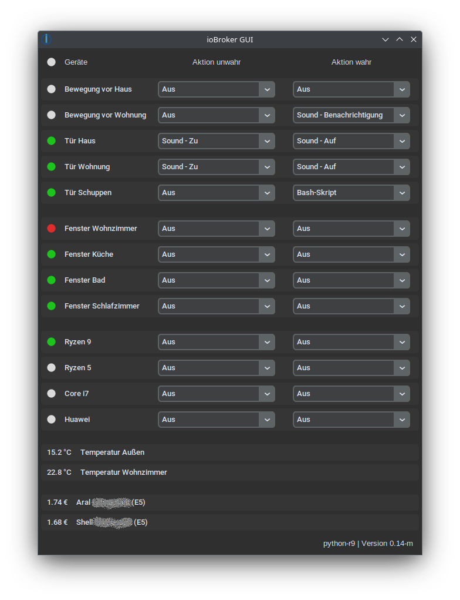
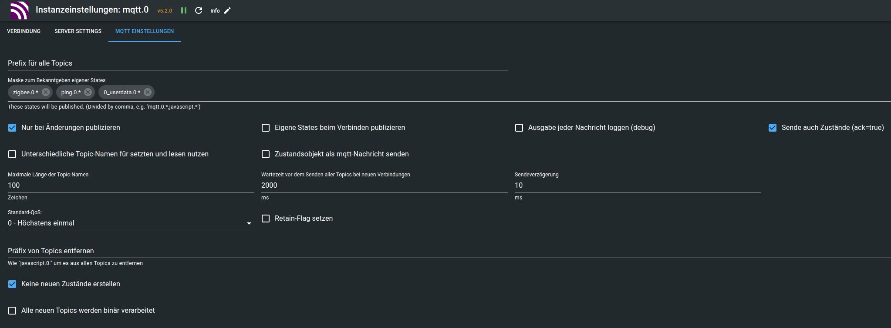

# ioBroker-GUI
#### ioBroker GUI ist ein OpenSource Desktop-Client für Linux, welcher um Aufmerksamkeit zu erhalten Sounds abspielt oder Bash-Skripts ausführt.
Die jeweiligen Zuordnungen lassen sich im Vorfeld konfigurieren oder im Betrieb mit zwei Klicks ändern.
Die Benutzeroberfläche, Audioausgabe sowie Logs sind in Deutsch gehalten.

Für die Funktion vorrausgesetzt ist eine im ioBroker eingerichtete [Mqtt-Server-Instanz](#Konfiguration-der-Mqtt-Instanz).



## Abhängigkeiten
### Debian
```
apt install git python3 python3-tk python3-venv python3-pip
```

## Installation
```
git clone https://github.com/root-at-pi/ioBroker-GUI.git
cd ioBroker-GUI/
python3 -m venv venv
source venv/bin/activate
pip3 install -r requirements.txt
```

## Start
```bash
#!/bin/bash
cd ioBroker-GUI/
source venv/bin/activate
python3 main.py
```

## Konfiguration
Die *config.xml* beinhaltet einige Beispiel-Konfigurationen
```xml
<setting>
    <appearance>system</appearance>                         <!-- Erscheinungsbild: system, dark, light -->
    <server_host>192.168.2.12</server_host>                 <!-- Adresse des ioBroker-Server -->
    <server_port>1883</server_port>                         <!-- Port der Mqtt-Instanz -->
    <client_id>testing-config</client_id>                   <!-- Name des Clients -->
    <client_user>ms</client_user>                           <!-- Benutzername der Mqtt-Instanz -->
    <client_pw>geheim</client_pw>                           <!-- Passwort der Mqtt-Instanz -->
</setting>
```
```xml
<action>
    <description>Sound - Benachrichtigung</description>     <!-- Name der Aktion -->
    <run>sound</run>                                        <!-- Art der Aktion: sound, bash -->
    <file>sound/sig_notification.wav</file>                 <!-- Pfad zur Sound- oder Bash Datei -->
    <parameters>none</parameters>                           <!-- Optionale Parameter für die Bash -->
</action>
```
#### Es gibt aktuell 4 Typen von Geräten
- `bool` Wahr/Unwahr, sichtbar mit Aktion
- `hidden` wie bool nur unsichtbar
- `float` Anzeige einer Dezimalzahl ohne Aktion
- `separator` Trenner
```xml
<device>
    <description>Tür Haus</description>                     <!-- Name des Geräts -->
    <adress>zigbee/0/0000000000000000/opened</adress>       <!-- Adresse des Geräts -->
    <default_false>Sound - Zu</default_false>               <!-- Aktionszuweisung für unwahr beim Programmstart -->
    <default_true>Sound - Auf</default_true>                <!-- Aktionszuweisung für wahr beim Programmstart -->
    <color_false>default</color_false>                      <!-- Farbe für unwahr: default, white, orange, green, red -->
    <color_true>default</color_true>                        <!-- Farbe für wahr: default, white, orange, green, red -->
    <round>2</round>                                        <!-- Runden des Anzeigewertes bei Typ float -->
    <unit> €</unit>                                         <!-- Anhängen einer Einheit bei Typ float -->
    <type>bool</type>                                       <!-- Typ des Geräts -->
</device>
```

## Konfiguration der Mqtt-Instanz
### Verbindung
- IP `Server/Broker`
- Benuter `Benutzername`
- Passwort `Passwort`

### Server Settings
- Leere Session erzwingen `Immer leere Session für alles Clients`

### Mqtt Einstellungen
- Maske zum Bekanntgeben eigener States `0_userdata.0.* zigbee.0.* usw.`
- [ ] Eigene States beim Verbinden publizieren ***Abschalten***
- [x] Sende auch Zustände (ack=true) ***Einschalten***
- [x] Keine neuen Zustände erstellen ***Einschalten***


